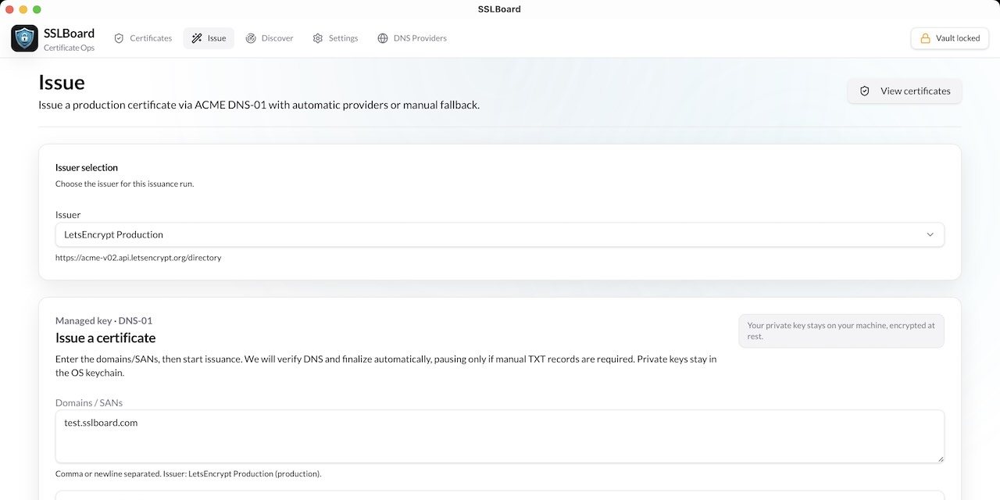

# SSLBoard Desktop

[](https://opensource.org/licenses/Apache-2.0)

A secure desktop application for issuing, managing, and distributing SSL/TLS certificates. SSLBoard keeps sensitive secrets (DNS API credentials, CA private keys, ACME account keys) securely stored on your local machine, ensuring they never leave your device.



## What is SSLBoard Desktop?

SSLBoard Desktop is an open-source tool designed for developers and DevOps teams to handle certificate lifecycle management with a focus on security and simplicity. It currently supports public certificate issuance via ACME (with private PKI planned), with robust distribution options and a local-first approach to trust boundaries.

### Key Features

#### ✅ Currently Implemented

- **Public Certificate Issuance**: Issue SSL/TLS certificates via ACME DNS-01 challenges with Let's Encrypt (staging and production). Supports both managed-key issuance and CSR-based issuance.
- **Key Generation**: Generate private keys locally with RSA (2048/3072/4096) and ECDSA (P-256/P-384) algorithms.
- **CSR Support**: Import existing CSRs or generate new CSRs locally for endpoint-owned key workflows.
- **DNS Provider Management**: Configure DNS providers (Cloudflare, DigitalOcean) for automated DNS-01 challenges, with manual DNS fallback when needed.
- **Secure Secret Storage**: Secrets (DNS API tokens, ACME account keys, private keys) are stored locally using OS keychains (macOS Keychain, Windows Credential Vault, Linux Secret Service) and never transmitted.
- **Certificate Export**: Export certificates in standard PEM formats (certificate, chain, fullchain) with optional private key export (guarded by user confirmation).
- **Certificate Inventory**: Local certificate inventory with metadata tracking, expiration dates, subject information, and source tracking.
- **Issuer Management**: Configure and manage ACME issuers (Let's Encrypt staging/production) with automatic account key generation.
- **DNS Challenge Engine**: Manual DNS record fallback with propagation polling when automated DNS providers are unavailable.
- **UI/UX**: Modern React-based interface with shadcn/ui components, built as a Tauri app for cross-platform desktop support (macOS, Windows, Linux).

#### 🚧 Planned (Not Yet Implemented)

- **Private PKI**: Issue private certificates using a constrained PKI system (root or root+intermediate CA, server/client certs). *Coming soon*
- **Certificate Renewal Scheduling**: Automatic renewal scheduling. *Coming soon*
- **Certificate Revocation**: Revoke ACME-issued certificates using private key or account key authentication. *Coming soon*
- **Distribution Options**: Kubernetes Secret integration, GitOps support, and encrypted relay capabilities for automated certificate distribution.
- **Certificate Discovery (CT Only)**: Certificate Transparency discovery and inventory import.
- **HTTP-01 Challenges**: Alternative ACME challenge method for certificate issuance.
- **macOS Biometric Access**: Touch ID/Face ID authentication for secret access on macOS.

### Security Principles

- **Local Trust Boundary**: All sensitive operations occur on-device; no secrets are sent to external services.
- **Human-in-the-Loop**: Explicit user consent required for sensitive actions like private key export.
- **Vault Behavior**: The vault auto-unlocks when secrets are needed (with OS authentication if required); users can manually lock the vault at any time.
- **Separation of Concerns**: Issuance, distribution, and visibility are modular and configurable.
- **Opinionated Simplicity**: Tailored for small-to-medium teams; not a full enterprise PKI engine.

### Key Ownership Models

- **Endpoint-Owned Keys (Recommended)**: Endpoints generate private keys; SSLBoard signs CSRs and distributes certificates only.
- **Issuer-Generated Keys**: SSLBoard generates key+certificate pairs; distribution requires careful handling.

## Architecture

SSLBoard uses a two-domain architecture for security:

- **UI Layer (TypeScript/React)**: Handles workflows, forms, and state management. Treated as untrusted and never accesses raw secrets.
- **Core Layer (Rust/Tauri)**: Manages issuance, secret storage, distribution, and audit logging. All privileged operations occur here.

Modules under `src-tauri/src`:

- `core/`: IPC commands, DTOs, error handling
- `secrets/`: OS keychain adapters for secure storage
- `issuance/`: ACME drivers, DNS providers, CSR tools (private PKI planned)
- `distribution/`: Export functionality (Kubernetes, GitOps integrations planned)
- `storage/`: Metadata storage (SQLite) for certificates, issuers, DNS providers
- `audit/`: Append-only local audit log (planned)

## Installation

### Prerequisites

- Node.js (v18+)
- Rust (latest stable)
- Tauri CLI: `npm install -g @tauri-apps/cli`

### Build from Source

1. Clone the repository:
   ```bash
   git clone https://github.com/your-org/sslboard-desktop.git
   cd sslboard-desktop
   ```

2. Install dependencies:
   ```bash
   npm install
   ```

3. Build and run:
   ```bash
   npm run tauri dev  # Development mode
   npm run tauri build  # Production build
   ```

For detailed setup, see `docs/technical.md`.

## Usage

1. **Configure Issuers**: Set up ACME issuers (Let's Encrypt staging/production) in Settings → Issuers. Account keys are automatically generated and stored securely.
2. **Configure DNS Providers** (Optional): Add API tokens for Cloudflare, DigitalOcean, or AWS Route 53 in Settings → DNS Providers for automated DNS-01 challenges. If not configured, manual DNS record setup is available.
3. **Issue Certificates**: Use the Issue page to request certificates:
   - **Managed Key Mode**: Let SSLBoard generate and manage the private key automatically.
   - **CSR Mode**: Import an existing CSR or generate a CSR locally for endpoint-owned keys.
4. **Complete DNS Challenges**: If automated DNS providers are configured, challenges are handled automatically. Otherwise, follow the manual DNS record instructions shown in the UI.
5. **Manage Inventory**: View, filter, and export certificates from the Certificates page. See certificate details, expiration dates, and metadata.
6. **Export Certificates**: Export certificates as PEM bundles (certificate, chain, fullchain) with optional private key export (requires confirmation).

See `docs/functional.md` for workflow narratives and `docs/technical.md` for architecture details.

## Contributing

We welcome contributions! Please read our [Contributing Guide](CONTRIBUTING.md) before getting started.

- **Issues**: Report bugs or suggest features on GitHub.
- **Pull Requests**: Follow the OpenSpec process for proposals (see `openspec/AGENTS.md`).
- **Code Style**: Rust code follows `rust-code-quality/spec.md`; UI follows `ui-code-quality/spec.md`.

### Development Setup

- Run linting: `npm run lint`
- Run tests: `npm run test` (if available)
- Check type safety: `npm run typecheck`

## License

This project is licensed under the Apache License 2.0. See [LICENSE](LICENSE) for details.

Note: While the core is open-source, future paid features (e.g., SSLBoard Cloud integration) may require a commercial license.

## Documentation

- `docs/functional.md` — Product scope, distribution patterns, non-goals
- `docs/technical.md` — Architecture, IPC design, storage, security
- `docs/other.md` — Threat model, key lifecycle, MVP scope
- `openspec/specs/` — Detailed specifications for features

## Roadmap

### ✅ Completed (MVP)

1. ✅ Public ACME issuance with DNS-01
2. ✅ Local OS keychain secret storage
3. ✅ PEM export with guarded private key option
4. ✅ Certificate inventory with metadata tracking
5. ✅ CSR-based issuance support
6. ✅ Multiple key algorithm support (RSA/ECDSA)
7. ✅ Certificate renewal (manual + scheduled)
8. ✅ DNS provider adapters for Cloudflare and DigitalOcean

### 🚧 In Progress / Planned

- **Certificate Renewal Scheduling**: Automatic renewal scheduling
- **Certificate Revocation**: ACME certificate revocation support
- **Private PKI**: Root CA and intermediate CA management for internal certificates
- **Kubernetes Secret Distribution**: Direct integration with Kubernetes clusters
- **DNS Provider Adapters**: Route 53 adapter
- **Certificate Discovery (CT Only)**: Certificate Transparency integration
- **GitOps Distribution**: Integration with SealedSecrets, SOPS, and GitOps workflows

For detailed feature proposals and upcoming work, check `openspec/changes/`.
